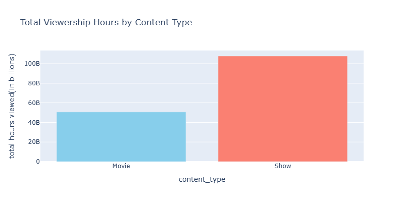
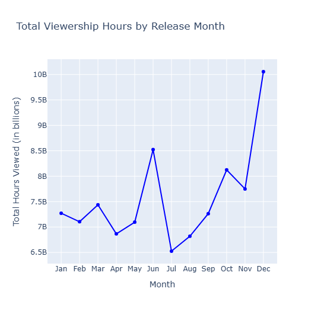
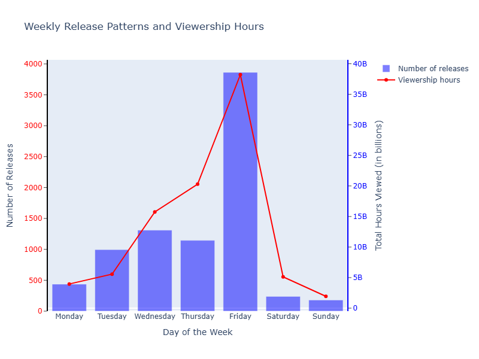

# overview

This project analyzes Netflix viewership patterns to understand the mindset of Netflix subscribers and identify what type of content attracts more viewers.
By leveraging Release Date, Hours Viewed, Language Indicator, and Content Type, we reveal timing, popularity, language trends, and format preferences driving engagement.

# The Questions

1. Which content (Shows or Movies) drives more total viewership on Netflix in 2023?
2. What language gets more total views in 2023?
3. What are the peak month for Netflix viewership in 2023?
4. Which season has the highest total viewership?
5. What day of the week gets the highest viewership?

# Tools I Used

For my deep dive into the data analyst job market, I harnessed the power of several key tools:

- **Python** : The backbone of my analysis, allowing me to analyze the data and find critical insights.I also used the following Python libraries:
  - **Pandas Library**: This was used to analyze the data.
  - **Plotly Library**: For creating interactive, web-based visualizations
- **jupyter Notebooks**: The tool I used to run my Python scripts which let me easily include my notes and analysis.
- **Visual Studio Code**: My go-to for executing my Python scripts.
- **Git & GitHub**: Essential for version control and sharing my Python code and analysis, ensuring collaboration and project tracking.

# Data Preparation and Cleanup

This section outlines the steps taken to prepare the data for analysis, ensuring accuracy and usability.

# Import & Clean Up Data

I start by importing necessary libraries and loading the dataset

```python
import pandas as pd
import plotly.express as px
import plotly.graph_objects as go
import plotly.io as pio
netflix_data = pd.read_csv('netflix_content.csv')
```

I start with cleaning and preprocessing the 'Hours Viewed' column to prepare it for analysis.

```python
netflix_data['Hours Viewed']=netflix_data['Hours Viewed'].replace(',','',regex=True).astype(float)
netflix_data
```

# The Analysis

Each Jupyter notebook for this project aimed at investigating specific aspects of the data job market. Here’s how I approached each question:

# 1. Which content (Shows or Movies) drives more total viewership on Netflix in 2023?

to determine whether shows or movies dominate viewership I’ll analyze trends in content type

View my notebook with detailed steps here:['Netflex_Analyze'](Netflex_Analyze.ipynb)

## Visualize Data

```python
content_type=netflix_data.groupby('Content Type')['Hours Viewed'].sum()
fig= go.Figure(data=[go.Bar(x=content_type.index, y=content_type.values, marker_color=['skyblue','salmon'])])

fig.update_layout(title='Total Viewership Hours by Content Type',
xaxis_title='content_type',yaxis_title='total hours viewed(in billions)',height=400,width=800)

fig.show()
```

## Results



## Insights:

- Shows dominate Netflix viewership with 100 billion hours in 2023, compared to 40 billion hours for Movies — a clear 2.5:1 ratio.
- Movies represent just 28.6% of total hours viewed, despite being a high-profile content category on the platform.
- The average Show drives 2.5 times more total watch time than the average Movie, confirming binge-watching behavior as the primary driver of engagement.

# 2. What language gets more total views in 2023?

to understand which languages are contributing the most to Netflix’s content consumption, I analyze the distribution of viewership across different languages

## Visualize Data

```python
fig=go.Figure(data=[go.Bar(x=language_of_content.index, y=language_of_content.values )])

fig.update_layout(title='Total Viewership Hours by language',
xaxis_title='language',yaxis_title='total hours viewed')
fig.show()
```

## Results


### Insights

- English-language content dominates global viewership with over 110 billion hours, accounting for the vast majority of total watch time on the platform.
- Korean content ranks second with approximately 15 billion hours, highlighting the global rise of K-dramas and Korean media as a significant non-English driver of engagement.
- Non-English languages (Korean, Japanese, Hindi, Russian) combined contribute less than 25% of total viewership, underscoring English as the primary language of consumption despite growing international content diversity.

# 3.What are the peak month for Netflix viewership in 2023?

to identify any trends over time I’ll analyze how viewership varies based on release months

## Visualize Data

```python
netflix_data['Release Month'] = pd.to_datetime(netflix_data['Release Date']).dt.month
monthly_viewership = netflix_data.groupby('Release Month')['Hours Viewed'].sum()

fig = go.Figure(go.Scatter(x=monthly_viewership.index, y=monthly_viewership.values))
fig.update_layout(title='Viewership by Release Month',
                  xaxis=dict(tickvals=list(range(1,13)),
                             ticktext=['Jan','Feb','Mar','Apr','May','Jun',
                                       'Jul','Aug','Sep','Oct','Nov','Dec']))
fig.show()
```

## results



### Insights

- December peaks at nearly 10 billion hours viewed, ~40% above the yearly average, driven by holiday releases.
- August records the lowest viewership at ~6.5 billion hours, marking a clear mid-year dip.
- Viewership follows a U-shaped trend, declining through summer before surging in Q4.

# 4. Which season has the highest total viewership?

to identify Which season has the highest total viewership. let’s explore the total viewership hours distributed across different release seasons

## Visualize Data

```python
def get_season(month):
    if month in [12,1,2]: return 'Winter'
    elif month in [3,4,5]: return 'Spring'
    elif month in [6,7,8]: return 'Summer'
    else: return 'Fall'

netflix_data['Release Season'] = netflix_data['Release Month'].apply(get_season)
seasonal_viewership = netflix_data.groupby('Release Season')['Hours Viewed'].sum().reindex(['Winter', 'Spring', 'Summer', 'Fall'])
fig = go.Figure(data=[go.Bar(x=seasonal_viewership.index, y=seasonal_viewership.values, marker_color='magenta')])
```

## results


### Insights

- Fall dominates total viewership, reaching over 90 billion hours, far surpassing other seasons.
- Winter, Spring, and Summer show relatively stable viewership, each around 20–25 billion hours, indicating consistent but lower engagement.
- The strong Fall spike suggests a seasonal viewing trend, possibly due to major releases or increased audience activity toward year-end.

# 5. What day of the week gets the highest viewership?

To identify the day of the week that gets the highest viewership, let’s explore whether Netflix has a preference for releasing content on specific weekdays and how this influences viewership patterns.

## Visualize Data

```python
netflix_data['Release day'] = netflix_data['Release Date'].dt.day_name()
weekday_releases = netflix_data['Release day'].value_counts().reindex(['Monday', 'Tuesday', 'Wednesday', 'Thursday', 'Friday', 'Saturday', 'Sunday'])
weekday_viewership = netflix_data.groupby('Release day')['Hours Viewed'].sum().reindex(['Monday', 'Tuesday', 'Wednesday', 'Thursday', 'Friday', 'Saturday', 'Sunday'])
fig = go.Figure([go.Bar(x=weekday_releases.index, y=weekday_releases.values, name='Number of releases'),
                 go.Scatter(x=weekday_viewership.index, y=weekday_viewership.values, mode='lines+markers', name='Viewership hours')])
fig.update_layout(title='Weekly Release Patterns and Viewership Hours', xaxis_title='Day of the Week')

```

## results



### Insights

- Friday stands out with the highest number of releases and the greatest total viewership, showing it is the most impactful day for new content.
- Midweek days like Wednesday and Thursday also see steady releases and increasing viewership, suggesting growing engagement before the weekend.
- Saturday and Sunday have the lowest releases and viewership, indicating fewer new drops and reduced audience activity during weekends.

# What I Learned

Throughout this project, I deepened my understanding of Netflix’s content trends and viewer behavior while enhancing my technical skills in Python, particularly in data manipulation and visualization. Here are a few specific things I learned:

**Advanced Python Usage:** Utilizing libraries such as Pandas for data processing, Plotly for interactive visualization helped me analyze Netflix viewing patterns more effectively.

**Data Cleaning Importance:** I learned that thorough data cleaning and preprocessing are essential before performing any analysis, ensuring that insights about release schedules and viewership trends are accurate and reliable.

**Strategic Content Insights:** The project highlighted how data can uncover Netflix’s release strategies and audience preferences. Understanding when and how viewers engage with content provides valuable insights into optimizing release timing and improving audience engagement.

# Challenges I Faced

This project was not without its challenges, but it provided good learning opportunities:

**Data Inconsistencies**: Handling inconsistent data entries requires careful consideration and thorough data-cleaning techniques to ensure the integrity of the analysis.

**Complex Data Visualization**: Designing effective visual representations of complex datasets was challenging but critical for conveying insights clearly and compellingly.

**Balancing Breadth and Depth**: Deciding how deeply to dive into each analysis while maintaining a broad overview of the data landscape required constant balancing to ensure comprehensive coverage without getting lost in details.

# Conclusion

This exploration into Netflix’s viewership patterns has been highly insightful, revealing how release timing and seasonal trends influence audience engagement. The insights gained deepen my understanding of viewer behavior and offer valuable guidance for optimizing content strategies. As viewing habits continue to evolve, ongoing analysis will be essential to stay aligned with audience preferences. This project provides a strong foundation for future explorations and highlights the importance of data-driven decision-making in the streaming industry.
